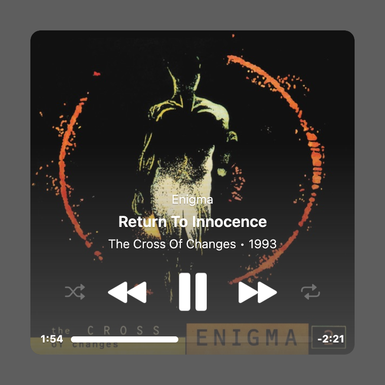
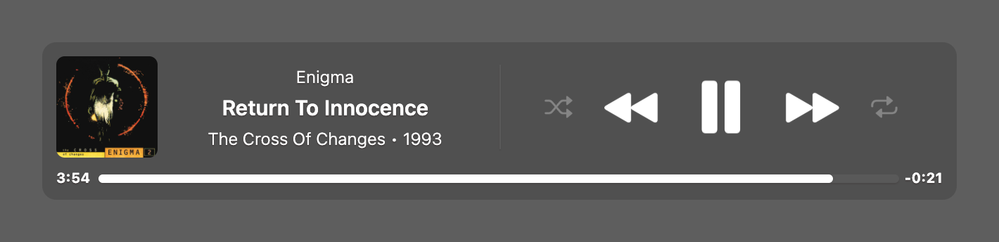
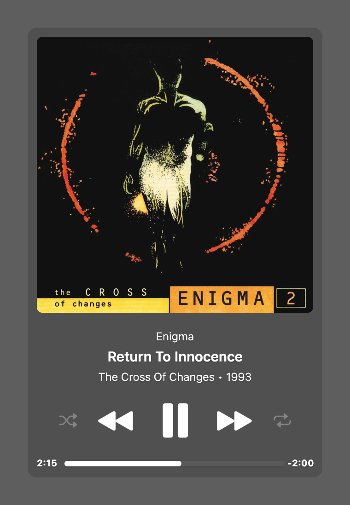

# Music

A music widget for [Übersicht](http://tracesof.net/uebersicht). It shows the track currently playing in Apple Music or Spotify: album art, artist, song, and album/year, with a progress bar and playback controls (previous / play-pause / next, plus shuffle and repeat). When a track is loved/favorited in Apple Music, a small star appears next to the title.

Music originally grew out of the now-retired [Playbox](https://github.com/Pe8er/Playbox.widget) widget by [Pe8er](https://github.com/Pe8er), and is now its own widget with multiple layouts, interactive controls, and full theming.

## Layouts

Music has three layouts, chosen with the `layout` option.

### Square

The album art fills the whole widget as a full-bleed background (opaque at the top, fading out toward the bottom), with the content snapped over the bottom.



### Horizontal

One row: album art and track info on the left, a divider, then the transport controls on the right.



### Vertical

One column: album art (full width) on top, then track info, the controls, and the progress bar.



Set `controls: false` to hide the transport controls and divider. The widget then collapses to a single column, and the album art doubles as a play/pause button.

## Options

Edit these at the top of `index.coffee`:

```coffeescript
  # --- Location ---
  widgetEnabled : true                 # true | false
  verticalPosition : "bottom"          # top | bottom | center
  horizontalPosition : "left"          # left | right | center

  # --- Layout ---
  layout : "square"                    # horizontal | vertical | square
  controls : true                      # true | false

  # --- Content ---
  contentAlign : "center"              # left | center | right
  progressBarPosition : "full"         # full | compact
  showTime : true                      # true | false
  showRemainingTime : false            # true | false
  showBothTimes : true                 # true | false
```

## Installation

- Download the [repository](https://github.com/dionmunk/uebersicht-music/archive/master.zip) and extract it.
- Place the `music.widget` folder in your Übersicht widgets folder.
- Refresh Übersicht.

The transport-control icons are macOS SF Symbols, rendered to themeable image masks on first run by a small Swift helper, so they follow your text color. This needs the Xcode Command Line Tools (`xcode-select --install`). The generated images are not bundled with the widget.

## Notes

- Apple Music exposes the release year and loved/favorited status; Spotify's scripting API does not, so those are omitted for Spotify tracks.
- Clicking the shuffle or repeat icon toggles that mode. Repeat cycles off, all, one in Apple Music.

## Theming

This widget is theme-aware. Its colors come from CSS custom properties (text, panel tint, status and series colors) with sensible built-in fallbacks, so it looks right on its own. Install the [Theme Controller](https://github.com/dionmunk/uebersicht-theme-controller) widget and this one automatically follows its color scheme and light/dark mode, staying in sync with the rest of the collection.

## License

This work is licensed under a [Creative Commons Attribution-NonCommercial 4.0 International License](https://creativecommons.org/licenses/by-nc/4.0/).
